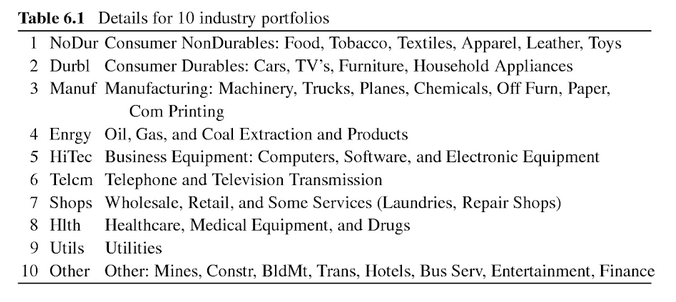

# Minimum Variance Portfolio

## Data
The data being used is provided by Kenneth French. The well known dataset '10 Industry Portfolios' contains 10 portfolios of different US-companies.



### Loading the data
Read 'average value weighted returns (monthly)' from line 12 to line 1121
```{r 10-industry-portfolios}
return_matrix = read.csv('10_Industry_Portfolios.CSV', header=TRUE, sep=',', skip = 11, nrows = 1109)
head(return_matrix)
```

## Calculate returns
Returns are generally [calculated logarithmically](https://quantivity.wordpress.com/2011/02/21/why-log-returns/), such that, considering a time-series of prices ${p_1, p_2, ..., p_T}$, the return at time i+1 is given by $$r_{i+1} = ln(p_{i+1}/p_{i}).$$
Just a side-note as we thankfully already work with a return_matrix.

## Computing the Covariance Matrix
Since the minimum-variance portfolio strategy seeks to minimize $$min_{w_t} w_t \Sigma_t w_t, 1_N w_t =^{!}1,$$
it is necessary to compute the covariance_matrix $w_t$ at time t.

This can be achieved by applying the cov() function to the rows (t-th row for time t) of return_matrix.
```{r}
nA = dim(return_matrix[,-1])[2] # number of assets
cov_return_matrix = cov(return_matrix[,-1]) # dates are deleted
```
All positive values in the cov_return_matrix, meaning there is at least some linear relation between all the values. 

## Interpret the problem as a system of linear equations
Now comes the maths-part. As written in deMiguel, we choose the weights according to the portfolio that minimizes the variance of return, e.g. $$\min_{w_t} w_t^{\perp}\Sigma_{t}w_{t}$$ under the restriction that $1_{N}^{\perp}w_{t} \overset{!}{=} 1$.
$$\Sigma_t R_t \overset{!}{=} 1$$,
where $\Sigma_t$ is the covariance matrix of the excess-returns $R_t$ at time $t$. If there are N risky assets considered, 1 is thought of as the N-dimensional vector containing 1's.

```{r}
b = vector(length=nA) + 1
x = solve(cov_return_matrix, b)
x = x/sum(x)
x
```

# Computing the global minimum-variance portfolio tutorial
I first wanted to do this with datacamp, but then I came across [this tutorial](http://enricoschumann.net/R/minvar.htm) (the first hit on google really). So I just want to follow the steps described there to get an understanding for the method.

## Generate example-data
As an example dataset, we create artificial returns with mean zero (the default with rnorm) and volatility 5%. (This order of magnitude would be reasonable for monthly equity returns.) These returns are stored in a matrix mData. 
```{r}
nO = 100  ## number of observations
nA = 10   ## number of assets
artificial_return_matrix = array(rnorm(nO * nA, sd = 0.05), 
               dim = c(nO, nA)) 
head(artificial_return_matrix)
```
The following section describes different approaches to gaining the weights.

## 

## Solving a system of linear equations
The weights are found as solution to the following linear system
$$\Sigma_t R_t \overset{!}{=} 1$$,
where $\Sigma_t$ is the covariance matrix of the excess-returns $R_t$ at time $t$. If there are N risky assets considered, 1 is thought of as the N-dimensional vector containing 1's.
```{r}
x = solve(cov(artificial_return_matrix), numeric(nA) + 1)
x = x/sum(x)
cov(artificial_return_matrix)
x
```