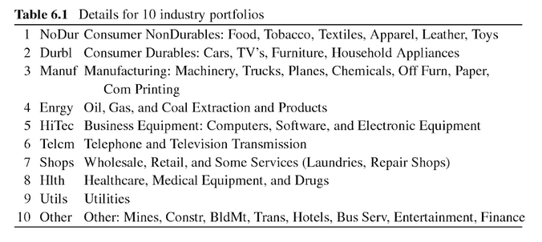

# Minimum Variance Portfolio

## Data
For portfolio construction, two different datasets are considered. The first one being 'Ten sector portfolios of the S&P 500 and the US equity market portfolio' by Roberto Wessels. Note that for this dataset, it is necessary to substract the Treasury Bill-rates from each entry to obtain adjusted returns stripped of the risk-free rate.

The other dataset concerned is provided by Kenneth French and downloaded from his website. The dataset is called 'SMB and HML portfolios and the US equity market portfolio' and contains the factors "Small Minus Big" (SMB) and "High Minus Low" (HMB) from the Fama-French three-factor model as well as the whole S&P500 portfolio. This dataset is already cleared from the risk-free rate, thus a Treasure Bill-rate adjustment is not necessary.



### Loading the data
Read both datasets and name them according to the number of assets included.
```{r 10-industry-portfolios}
return_matrix_eleven = read.csv('../ten-roberto-wessels.csv', header=TRUE, sep=',')
return_matrix_three = read.csv('../two-plus-one.csv', header=TRUE, sep = ',')
colnames(return_matrix_three)[1] = 'Date'

# data-cleaning: subtracting the tbill-rate from returns
sub_return_matrix = subset(return_matrix_eleven, select = -c(13))
sub_return_matrix = apply(sub_return_matrix[,-1], 2, '-', return_matrix_eleven[,13])
return_matrix_eleven = cbind(return_matrix_eleven$Date, sub_return_matrix)
colnames(return_matrix_eleven)[1] = 'Date'
```

## Computing the Covariance Matrix
As we saw in the section above, to minimize the overall variance, we first need to compute the covariance matrix. This can be achieved by applying the cov() function to the rows (t-th row for time t) of return_matrix.
```{r}
# function calcMinVarWeights expects a matrix of returns, where the first column
# contains an index (e.g. date) and all other columns contain returns.
# the function returns a normalized weights vector
calcMinVarWeights = function(return_matrix) {
  return_matrix = data.matrix(return_matrix) # convert for applying linear algebra
  
  # solve system of linear equations
  nA = dim(return_matrix[,-1])[2] # number of assets
  b = vector(length=nA) + 1 # constraint-vector
  cov_matrix = cov(return_matrix[,-1]) # dates are deleted
  weights = solve(cov_matrix, b)
  weights = data.matrix(weights/sum(weights)) # normalize the vector
  
  return (weights)
}
```
All positive values in the cov_matrix, meaning there is at least some linear relation between all the values. 

By evaluating the restrictions and definitions of the minimization-problem, you can define a Lagrangian, which can later be transposed into a linear system of equations of form
$$A \cdot x = b.$$ 
Since $A = \Sigma$ and $b = 1$ are known, we can solve this system to obtain $x = w_t.$

Note that negative weights are interpreted as *short sales*.

## Performance anaylsis
To evaluate the performance, the analysis from DeMiguel will be repeated. 

### in-sample Sharpe ratio
Below function calculates the in-sample Sharpe ratio.
```{r}
# the function inSamplesharpe expects a data frame, where the first column 
# contains an index (e.g. date) and all other rows contain returns.
# it returns the in-sample Sharpe ratio of said data frame.
inSampleSharpe = function(return_matrix) {
  
  # calculate weights
  weights = calcMinVarWeights(return_matrix)
  
  # calculate mean of each asset
  mean_returns = data.matrix(apply(return_matrix[,-1], 2, mean)) 
  
  # calculate sharpe-ratio according to formula
  cov_matrix = cov(return_matrix[,-1])
  sharpe_ratio_in_sample = 
  t(mean_returns) %*% weights/ sqrt(t(weights)%*%cov_matrix%*%weights)
  
  return (sharpe_ratio_in_sample)
}

### results for both datasets ###
sharpe_ratio_IS_three = inSampleSharpe(return_matrix_three)
sharpe_ratio_IS_eleven = inSampleSharpe(return_matrix)
sharpe_ratio_IS_three
sharpe_ratio_IS_eleven
```

### out-sample Sharpe ratio
DeMiguel et al. use a rolling-sample approach, where over a time period $T = 120$months, returns of the assets were being calculated. In each month $t$, starting form $t_0 = M + 1$, the data from the previous $M$ months was used to calculate the portfolio-weights $w_t$.

By adding the return of the next period and dropping the earliest return, the whole dataset is processed, resulting in a series of $T - M$ monthly *out-of-sample* returns generated by each strategy.

Then, the *out-of-sample Sharpe ratio* is computed. It consists of the sample mean of out-of-sample excess return $\mu_k$, devided by their sample standard deviation $\sigma_k$:
$$SR = \dfrac{\mu_k}{\sigma_k}$$

```{r}
# the function outSampleSharpe expects a return_matrix where the first column
# contains an index (e.g. a Date) and all other columns contain returns.
# parameter M (int) indicates the size of the rolling-sample
# parameter historyOfWeights (boolean) indicates if instead of a data frame
# with columns date, minvar-returns, cumulative minvar-returns 
# and cumulative naive-returns a data frame containing the weights should be 
# returned
outSampleSharpe = function(return_matrix, M, historyOfWeights) {
  return_matrix = data.matrix(return_matrix)
  nA = dim(return_matrix[,-1])[2] # number of assets
  T = dim(return_matrix)[1] # no of months
  t = M + 1 # adjust t_0 to size of rolling-sample
  b = vector(length=nA) + 1 # set up restraints_vector
  while (t <= T - 1) {
    tStart = t - M # lower barrier for the time-interval
    tEnd = t # upper barrier for the time-interval
    return_matrix_future = return_matrix[c(tEnd+1),] # return matrix t+1 in the future
    
    cov_return_matrix_t = cov(data.matrix(return_matrix[c(tStart:tEnd),-1])) # calculate cov-matrix for time t
    w_t = solve(cov_return_matrix_t, b) # solve system of equations
    w_t = w_t/sum(w_t) # normalize weights
  
    ## calculate returns
    ret_t = w_t %*% return_matrix_future[-1] #min-var returns
    naive_ret_t = (vector(length=nA) + 1/nA) %*% return_matrix_future[-1] #naive returns
  
    if(t == M+1) { # in the first iteration, create df
      if(historyOfWeights) {
            mu = data.frame(t(w_t))
      } else {
      mu = data.frame(return_matrix[,1][t], 
                      ret_t, 100 * (1 + ret_t), 
                      100 * (1 + naive_ret_t))
      colnames(mu) = c('Date', 
                       'returns', 
                       'cumulative returns', 
                       'naive cumulative returns')
        }
      } else {
        if(historyOfWeights) {
              # save weights
              mu = rbind(mu, w_t)
        } else {
          # calculate cumulative return
          cumul_ret = mu[tStart-1,3] * (1 + ret_t)
          naive_cumul_ret = mu[tStart-1,4] * (1 + naive_ret_t)
          # save returns
          new = data.frame(return_matrix[,1][t], 
                           ret_t, 
                           cumul_ret, 
                           naive_cumul_ret)
          colnames(new) = c('Date', 
                            'returns', 
                            'cumulative returns', 
                            'naive cumulative returns')
          mu = rbind(mu, new)
        }
    }
    t = t+1
    }
  return (mu)
}
mu_three = outSampleSharpe(return_matrix_three, 120, FALSE)
mu_eleven = outSampleSharpe(return_matrix_eleven, 120, FALSE)
mean(mu_three$returns) / var(mu_three$returns)
mean(mu_eleven$returns) / var(mu_eleven$returns)
```


## Plotting
Alla proposed differend kinds of plotting to us, two of them being a portfolio appreciation graph and the dynamics of weights. 

### portfolio appreciation graph
```{r}
library('zoo')
library('xts')
history_of_returns = data.frame(as.Date(as.character(mu$Date), format="%Y%m%d"), mu[,c(2:4)])
colnames(history_of_returns) = c('Date', 'Out-of-sample returns', 'cumulative returns', 'naive cumulative returns')
portfolio_appreciation = as.xts(history_of_returns[,c(-1,-2)], order.by=history_of_returns$Date)
zoo.appreciation = as.zoo(portfolio_appreciation)
cumretRainbow = rainbow(ncol(zoo.appreciation))
{plot.zoo(x = zoo.appreciation, main = 'Portfolio Appreciation', xlab='Time', ylab='Cumulative Risk-free Return (in %)', col = cumretRainbow, screens = 1)
legend(x = "topleft", legend = c("min-var", "naive"), lwd=5, col = cumretRainbow)
abline(v = c(as.Date('2000-03-11'), as.Date('2002-10-09')), col= 'blue')
text(x = as.Date('2000-03-01'), y=700, pos = 2, labels = 'dot-com crash', col='blue')
}

min(portfolio_appreciation$`cumulative returns`)
mean(portfolio_appreciation$`cumulative returns`)
max(portfolio_appreciation$`cumulative returns`)
mean(portfolio_appreciation$`naive cumulative returns`)
max(portfolio_appreciation$`naive cumulative returns`)
min(portfolio_appreciation$`naive cumulative returns`)
```

### Dynamics of weights
```{r}
history_of_weights = outSampleSharpe(return_matrix_eleven, 12, TRUE)
weightsHistoryDf = data.frame(return_matrix[14:dim(return_matrix)[1],1], history_of_weights)
colnames(weightsHistoryDf)[1] = "Date"

weightsHistoryDf$Date = as.yearmon(as.character(weightsHistoryDf$Date), format="%Y%m")
weightsHistoryXts = as.xts(weightsHistoryDf[,-1], order.by=weightsHistoryDf$Date)
zoo.weightsHistory = as.zoo(weightsHistoryXts)
weightsRainbow = rainbow(ncol(zoo.weightsHistory))
{
par(xpd=TRUE)
plot(zoo.weightsHistory, main='Weights Dynamics', xlab='Time', ylab='Relative Share of Portfolio (in %)', screens=1, col=weightsRainbow, xpd=TRUE)
legend(x = "topright", legend = colnames(weightsHistoryDf)[c(2:12)], lwd=2, col = weightsRainbow, inset=c(-0.06,0), xpd=TRUE, pt.cex = 1, cex = 0.5)}
```