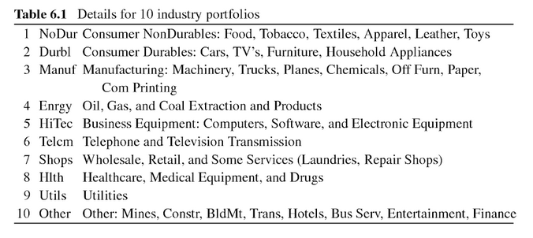

# Minimum Variance Portfolio

## Data
The data being used is provided by Kenneth French. The well known dataset '10 Industry Portfolios' contains 10 portfolios of different US-companies.



### Loading the data
Read 'average value weighted returns (monthly)' from line 12 to line 1121
```{r 10-industry-portfolios}
return_matrix = read.csv('10_Industry_Portfolios.CSV', header=TRUE, sep=',', skip = 11, nrows = 1109)
head(return_matrix)
```

## Computing the Covariance Matrix
As we saw in the section above, to minimize the overall variance, we first need to compute the covariance matrix. This can be achieved by applying the cov() function to the rows (t-th row for time t) of return_matrix.
```{r}
nA = dim(return_matrix[,-1])[2] # number of assets
cov_return_matrix = cov(return_matrix[,-1]) # dates are deleted
```
All positive values in the cov_return_matrix, meaning there is at least some linear relation between all the values. 

Above equation is of form
$$A \cdot x = b$$, thus a system of linear differential equations. Since $A = \Sigma$ and $b = 1$ are known, we can solve this system to obtain $x = R_t$ the 

```{r}
b = vector(length=nA) + 1
x = solve(cov_return_matrix, b)
x = x/sum(x)
x
```
Note that negative weights are interpreted as *short sales*.

## Performance anaylsis
To evaluate the performance, the analysis from deMiguel will be mimiced. DeMiguel et al. used a rolling-sample approach, where over a time period $T = 120$months, returns of the assets were being calculated. In each month $t$, starting form $t_0 = M + 1$, the data from the previous $M$ months was used to calculate the portfolio-weights $w_t$.
By adding the return of the next period and dropping the earliest return, the whole dataset is processed, resulting in a series of $T - M$ monthly *out-of-sample* returns generated by each strategy.

Then, the *out-of-sample Sharpe ratio* is computed. It consists of the sample mean of out-of-sample excess return $\mu_k$, devided by their sample standard deviation $\sigma_k$:
$$SR = \dfrac{\mu_k}{\sigma_k}$$

```{r}
nRows = dim(return_matrix)[1] # no of months
M = 120 # size of rolling-sample
t = M + 1 # adjust t_0 to size of rolling-sample
while (t <= nRows) {
  tStart = t - M #lower barrier for the time-interval
  tEnd = t #upper barrier for the time-interval
  return_matrix_T = return_matrix[c(tStart:tEnd),] #return matrix for time-interval
  # hier weitermachen
  t = t+1
}
```